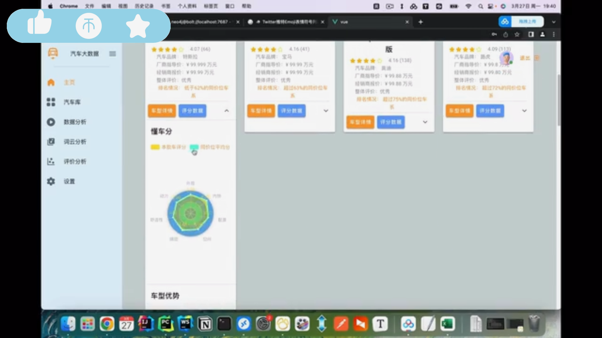
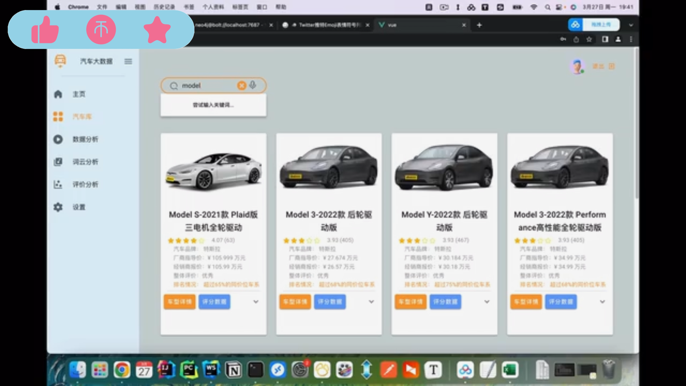
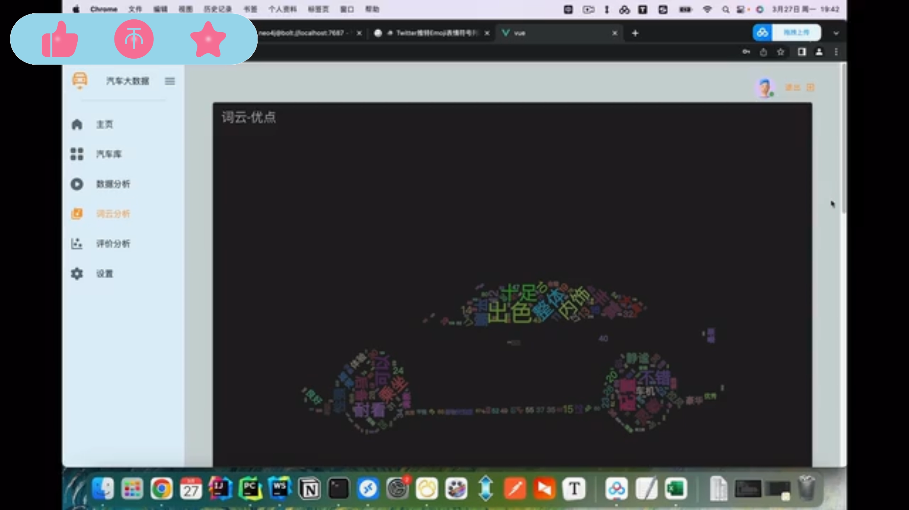

## 计算机毕业设计Flask+Vue.js汽车推荐系统 新能源汽车推荐系统 Python汽车数据可视化 懂车帝汽车爬虫 汽车大数据 汽车数据分析 机器学习 深度学习 知识图谱

## 要求
### 源码有偿！一套(论文 PPT 源码+sql脚本+教程)

### 
### 加好友前帮忙start一下，并备注github有偿纯python汽车推荐2025
### 我的QQ号是2827724252或者798059319或者 1679232425或者微信:bysj2023nb 或bysj1688

# 

### 加qq好友说明（被部分 网友整得心力交瘁）：
    1.加好友务必按照格式备注
    2.避免浪费各自的时间！
    3.当“客服”不容易，repo 主是体面人，不爆粗，性格好，文明人。
	
	
### 功能

双协同过滤推荐算法推荐汽车
多种可视化分析
vue + flask 前后端分离, mysql

### 演示视频
https://www.bilibili.com/video/BV1hz421B7D2/?spm_id_from=333.999.0.0

### 运行截图

